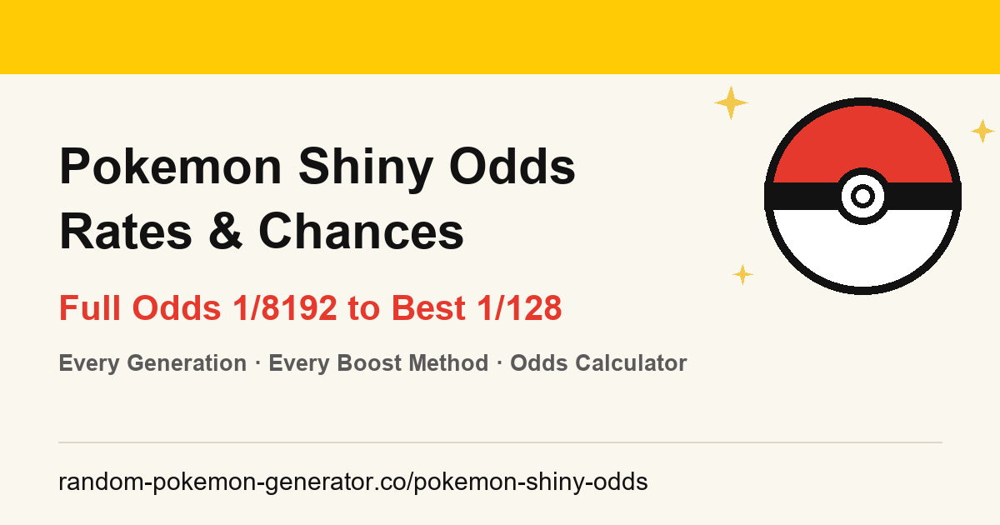

# Random Pokemon Generator

A full suite of random Pokémon tools built with vanilla HTML/CSS/JS — zero dependencies, no build step. Ten pages: generators, games, planners, and a shiny odds calculator.

**Live: [https://www.random-pokemon-generator.co/](https://www.random-pokemon-generator.co/)**



## What's inside

| Page | URL | Purpose |
|---|---|---|
| 🎲 Main Generator | [random-pokemon-generator.co](https://www.random-pokemon-generator.co/) | Random team builder (1–12 Pokémon) with 10+ filter dimensions |
| ✨ Shiny Odds Calculator | [/pokemon-shiny-odds/](https://www.random-pokemon-generator.co/pokemon-shiny-odds/) | Complete shiny rates for every game & method — base odds, Shiny Charm, Masuda, PLA outbreaks, SV sandwiches |
| 🌟 Shiny Generator | [/random-shiny-pokemon-generator/](https://www.random-pokemon-generator.co/random-shiny-pokemon-generator/) | Random shiny Pokémon generator with rarity simulation |
| 💎 Mega Generator | [/random-mega-pokemon-generator/](https://www.random-pokemon-generator.co/random-mega-pokemon-generator/) | Random Mega Evolution Pokémon generator |
| 📛 Name Generator | [/random-pokemon-name-generator/](https://www.random-pokemon-generator.co/random-pokemon-name-generator/) | Generate random Pokémon names from all 1,025 species |
| 👣 Nuzlocke Generator | [/nuzlocke-generator/](https://www.random-pokemon-generator.co/nuzlocke-generator/) | Nuzlocke-specific roller: starter teams, first encounters, death replacements |
| 🎡 Generator Wheel | [/random-pokemon-generator-wheel/](https://www.random-pokemon-generator.co/random-pokemon-generator-wheel/) | Spin-the-wheel style random Pokémon picker |
| 👥 Team Picker | [/pokemon-team-picker/](https://www.random-pokemon-generator.co/pokemon-team-picker/) | Pick a balanced Pokémon team with type coverage analysis |
| 🔥 Smash or Pass | [/pokemon-smash-or-pass/](https://www.random-pokemon-generator.co/pokemon-smash-or-pass/) | Swipe through Pokémon and build your favorites list |
| ❓ Who's That Pokemon | [/whos-that-pokemon/](https://www.random-pokemon-generator.co/whos-that-pokemon/) | Guess the Pokémon from its silhouette — classic mini-game |
| 🔒 Privacy Policy | [/privacy-policy/](https://www.random-pokemon-generator.co/privacy-policy/) | Plain-language privacy policy: local-only storage, GA4 analytics, opt-out guide |

## Shiny Odds Calculator

**Production Site: [https://www.random-pokemon-generator.co/pokemon-shiny-odds/](https://www.random-pokemon-generator.co/pokemon-shiny-odds/)**

The [shiny odds page](https://www.random-pokemon-generator.co/pokemon-shiny-odds/) covers every Pokémon game's shiny hunting mechanics:

- **Base odds** across all generations (1/8192 → 1/4096)
- **Shiny Charm** stacking (adds 2 extra rolls)
- **Masuda Method** (adds 5 extra rolls, stacks with Charm for 1/512)
- **PLA-specific**: Mass Outbreaks (1/158), Massive Mass Outbreaks (1/128), perfect research bonuses
- **Let's Go**: Catch combo + lure stacking (up to 1/273)
- **SV**: Sandwich powers + outbreak stacking
- **Probability calculator**: enter encounter count → see cumulative shiny chance

Data verified against Bulbapedia, Serebii, and community research.

## Features

### Main Generator
- 🎲 Random team generation (1–12 Pokémon) from all 1,025 species across Gen 1–9
- 🔍 10+ filter dimensions: generation, type, count, shiny, rarity, form, evolution stage, BST range, Pokédex color
- 📊 Team Tactical Report: S–D grade, 18-type defensive matrix, STAB offensive coverage, roles, weakness warnings
- 🕘 Roll History (localStorage, up to 20 squads) with hover preview, detail modal, and per-squad share links
- 🔗 Shareable config + squad links (filters and exact team encoded in URL)

### Nuzlocke Generator
- 🎲 Three Nuzlocke modes: starter team (6), first encounter (1), death replacement (1)
- 🚫 Nuzlocke rule toggles: ban legendaries/mythicals (on by default), unevolved-only hardcore mode
- 📊 Nuzlocke Squad Report: S–D grade, defensive matrix, STAB coverage, role tags, shared-weakness warnings
- 🕘 Roll History with per-roll share links and state-restoring replay

### Shiny & Mega Generators
- 🌟 Shiny-only rolls from all 1,351 species/form variants, nine filter dimensions, shiny-vs-regular compare switch, history + roll analysis
- 💎 Mega-Evolution-only rolls with stat gains over the base form and a shiny toggle

### Name Generator, Wheel, Team Picker, Smash or Pass, Who's That Pokemon
- 📛 120 original nickname ideas per species, built from type, color, habitat and stats
- 🎡 Animated spinning wheel with Gen/type limits — built for streams and drafts
- 👥 Six-slot squad builder with type matchup matrix, moves/natures/items, Showdown import/export
- 🔥 Dex-wide verdict game with shareable smash list
- ❓ Silhouette, pixel-art and cry guessing with 4 difficulty modes and progressive hints

### All pages
- ⚡ Zero-dependency static site: one `index.html` + one page script per tool, shared `styles.css` / `data.js` / `nav.js`
- 📱 Responsive: hamburger navigation and compact mobile layouts
- 🔎 SEO: semantic HTML, JSON-LD (SoftwareApplication + FAQPage + BreadcrumbList), OG/Twitter meta, canonical URLs, sitemap.xml
- 🕘 History, settings and share links persisted in localStorage / URL — no accounts, no tracking

## Usage

Open `index.html` in a browser (works from `file://` too) or serve statically:

```bash
# any static server, e.g.
python -m http.server 8000
```

Data sourced from [PokeAPI](https://pokeapi.co/) (sprites via official artwork CDN).

## Project structure

```
├── index.html                        # main generator page
├── app.js                            # main generator engine
├── nuzlocke-generator/
│   ├── index.html                    # nuzlocke generator page
│   ├── nuzlocke.js                   # nuzlocke engine (filters, analysis, history)
│   └── og-image.png
├── pokemon-shiny-odds/
│   ├── index.html                    # shiny odds reference + calculator page
│   ├── odds.js                       # odds calculator (games, boosts, probability)
│   └── og-image.png
├── random-shiny-pokemon-generator/
│   ├── index.html                    # shiny generator page
│   ├── shiny-generator.js            # shiny roller (filters, compare, history)
│   └── og-image.png
├── random-mega-pokemon-generator/
│   ├── index.html                    # mega generator page
│   ├── mega-generator.js             # mega roller (filters, stat gains)
│   └── og-image.png
├── random-pokemon-name-generator/
│   ├── index.html                    # name generator page
│   ├── name-generator.js             # nickname engine (7 categories)
│   └── og-image.png
├── random-pokemon-generator-wheel/
│   ├── index.html                    # wheel spinner page
│   ├── pokemon-wheel.js              # wheel draw logic
│   └── og-image.png
├── pokemon-team-picker/
│   ├── index.html                    # team picker page
│   ├── team-picker.js                # squad builder (slots, matrix, Showdown I/O)
│   └── og-image.png
├── pokemon-smash-or-pass/
│   ├── index.html                    # smash or pass page
│   ├── smash-or-pass.js              # verdict game logic
│   └── og-image.png
├── whos-that-pokemon/
│   ├── index.html                    # guessing game page
│   ├── whos-that-pokemon.js          # silhouette/pixel/cry game logic
│   ├── correct.wav / incorrect.wav   # answer sounds
│   └── og-image.png
├── privacy-policy/
│   ├── index.html                    # privacy policy page (local storage, GA4, opt-out)
│   └── og-image.png
├── nav.js                            # hamburger nav toggle (shared)
├── data.js                           # Pokémon dataset (1,351 entries)
├── moves-data.js / moveset.js        # move pools and learnset data
├── crymap.js                         # Pokémon cry mappings
├── styles.css                        # all styles
├── og-image.png                      # social card (homepage)
├── sitemap.xml                       # XML sitemap for search engines
├── robots.txt
├── vercel.json                       # index.html → directory URL redirects
├── SEO-KEYWORDS.md                   # keyword baseline for all 10 pages
└── AGENTS.md                         # project rules (SEO-first workflow)
```

## License

Open source — see repository for details.
